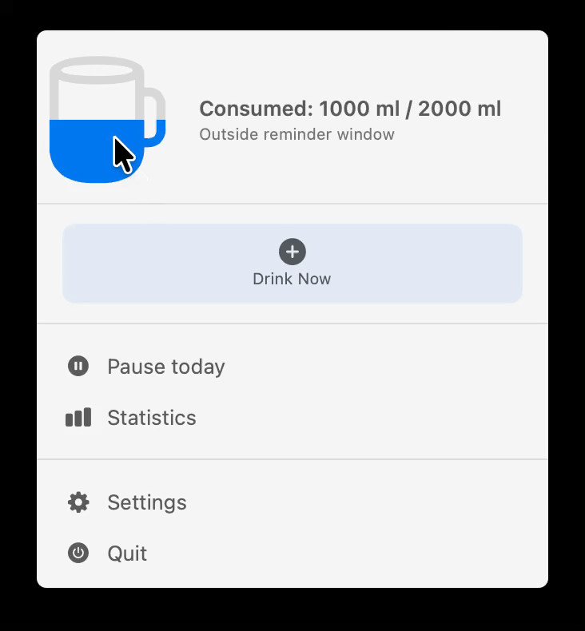
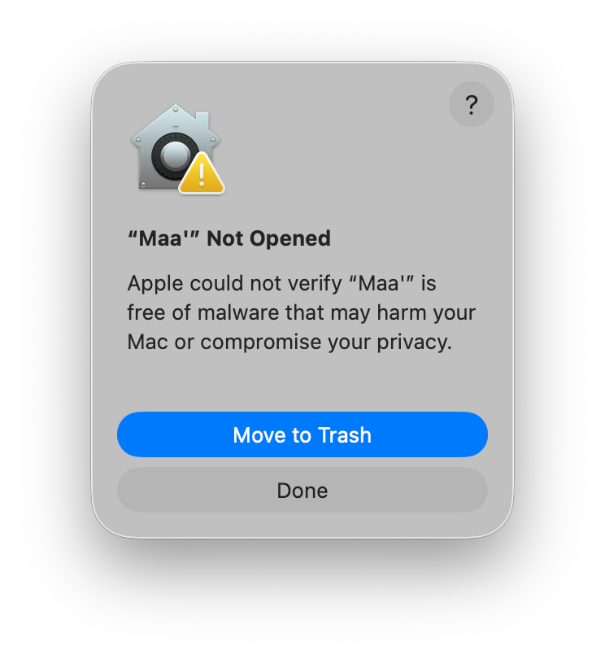

<p align="center">
  
</p>

<h1 align="center">Maa' (ماء)</h1>

<p align="center">
  <b>A lightweight, native, and exceptionally battery-friendly macOS status bar companion designed to keep you hydrated.</b>
</p>

<p align="center">
  <a href="https://developer.apple.com/swift/">
    
  </a>
  <a href="https://developer.apple.com/macos/">
    
  </a>
  <a href="https://brew.sh/">
    
  </a>
  <a href="https://sparkle-project.org/">
    
  </a>
  <a href="https://opensource.org/licenses/MIT">
    
  </a>
</p>

---

Maa' (Arabic for *Water*) is a beautifully designed macOS menu bar utility that reminds you to drink water at intervals you define. Built entirely with SwiftUI and native AppKit integrations, it feels like a first-party utility built by Apple. It operates with a strict focus on system efficiency, native aesthetics, and user productivity.

---

## Screenshots

#### 1. Menu Bar Popover & Wave Animation
> **How to capture**: Open the Maa' dropdown from the status bar, log a drink to see the fluid animation inside the cup, and take a screenshot of the popup. 

<p align="center">
  
</p>

#### 2. Native Tabbed Settings
> **How to capture**: Click "Settings" in the app, click the "Schedule" or "Goal" tab to display the native macOS compact time pickers and monochrome toggle. Save as `docs/screenshots/settings-panel.png`.
```markdown
<!-- Replace this with:  -->
```

#### 3. Daily Goal Reached & Status Badge
> **How to capture**: Add enough water intake to hit your daily goal. Capture the congrats animation card inside the menu popover, or the green checkmark badge on the status bar icon. Save as `docs/screenshots/goal-reached.png`.
```markdown
<!-- Replace this with:  -->
```

---

## Installation

### Method 1: Homebrew Cask (Recommended)
You can install Maa' directly via Homebrew from the official custom tap:

```bash
# Add the tap
brew tap w77sh/tap

# Install Maa' (specify the full tap prefix to avoid conflicts with core casks)
brew install --cask w77sh/tap/maa
```

### Method 2: Direct DMG Download
1. Navigate to the [Releases](https://github.com/w77sh/Maa/releases) page.
2. Download the latest `Maa-[Version]-[Build]-macOS.dmg` archive.
3. Open the DMG and drag **Maa'** to your `Applications` directory.

### Bypassing macOS Gatekeeper Warning

Because Maa' is distributed as a self-signed binary, macOS Gatekeeper may prevent it from opening on the first launch, showing the following warning:

<p align="center">
  
</p>

To bypass this security warning, you can strip the macOS quarantine flag by running the following command in Terminal:

```bash
xattr -dr com.apple.quarantine /Applications/Maa\'.app
```

---

## Local Development

### Prerequisites
* macOS 14.0 (Sonoma) or newer.
* Xcode 15.0 or newer (Swift 5.9+).

### Building & Running
Clone the repository:
```bash
git clone https://github.com/w77sh/Maa.git
cd Maa
```

To compile and install the application locally into your `/Applications` directory, run the helper script:
```bash
./scripts/install-local-app.sh
```

### Adding New Translations
Maa' makes it straightforward to add new languages. Translations are organized into separate `.lproj` folders under `Drink Reminder/`:
1. Create a new directory named after the ISO language code (e.g. `fr.lproj` for French) inside `Drink Reminder/`.
2. Add a `Localizable.strings` file inside it.
3. Copy the keys from `Drink Reminder/en.lproj/Localizable.strings` and translate the values.
4. Open a Pull Request!

---

## License
This project is licensed under the MIT License - see the [LICENSE](LICENSE) file for details.
